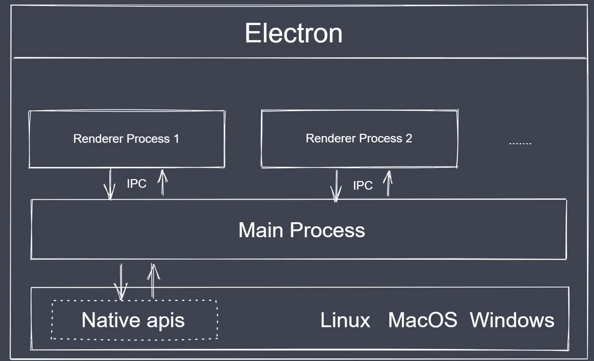
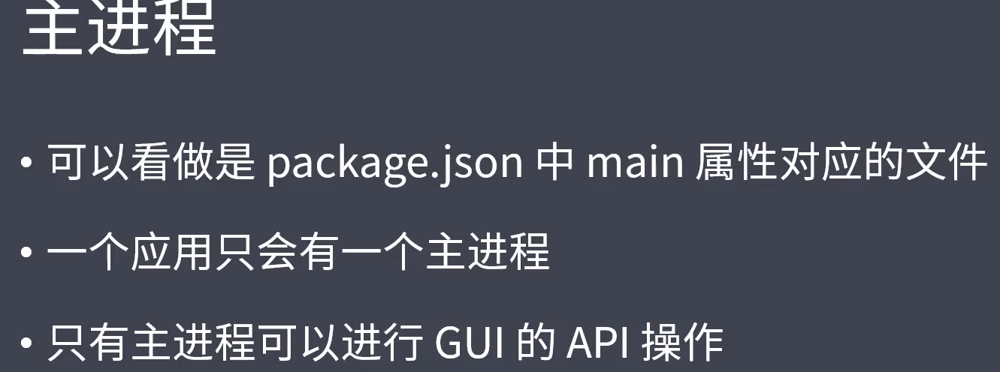
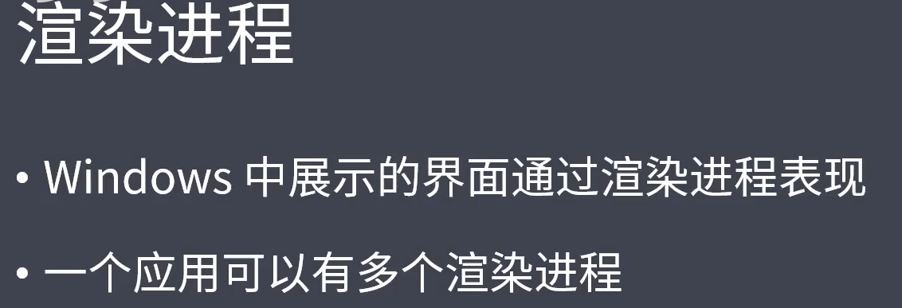
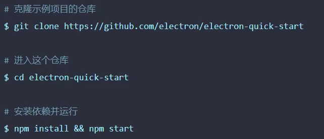
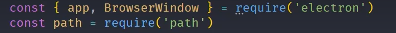
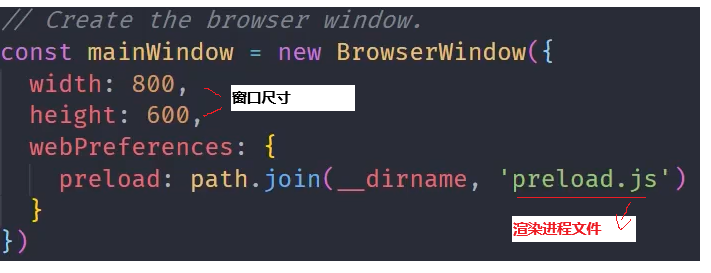
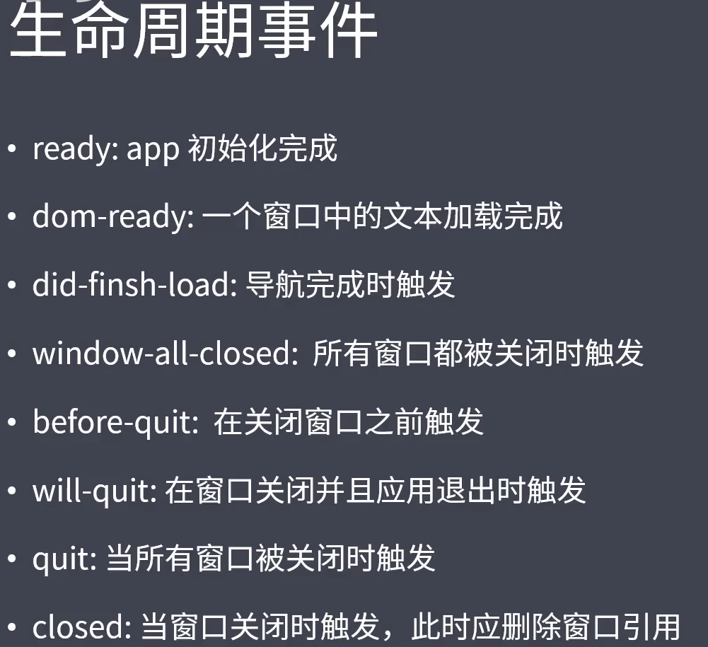
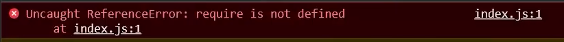
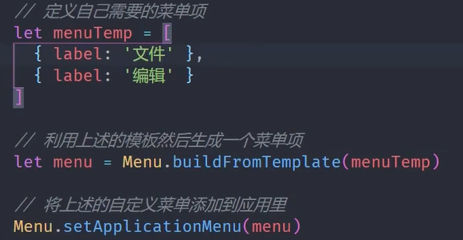

# 概述
课程位置：https://www.bilibili.com/video/BV1xd4y1J7dB/?spm_id_from=333.337.search-card.all.click
## 工作流程图

## 主进程

## 渲染进程

# electron 环境搭建
## 环境搭建流程
git clone https://github.com/electron/electron-quick-start
cd .\electron-quick-start\
npm install 
npm start

## 打开调试模式
    main.js中查找 // mainWindow.webContents.openDevTools()并将其打开
## 刷新界面
    如果只是修改了index.html 可以通过ctrl+r刷新窗口
## 热更新的设置
热更新：修改主进程或者渲染进程然后保存，就可以直接重启启动electron应用，而不需要每次都手动重启

<b>注意：</b>
该方法只有在主进程文件中使用保存才可以起效，哪怕修改index.html要想查看最新效果都需要在主进程页面重新保存一次
<b>如果只是修改了index.html 可以通过ctrl+r刷新窗口</b>

"scripts": {
    "start": "electron ."
},
将<b>package.json</b>中上面内容，修改为以下内容
注意需要安装nodemon： npm install nodemon
"scripts": {
    "test": "echo \"Error: no test specified\" && exit 1",
    "start": "nodemon --watch main.js --exec npm run build",
    "build": "electron ."
  },
# 主进程(main.js)简单介绍
## 导入

## 创建窗口
1 创建出口
2 让窗口加载一个界面，界面用web技术实现，并且运行在渲染进程中
function createWindow(){
  let mainWin = new BrowserWindow({
    // x, y 设置窗口的显示位置，相对于屏幕的左上角
    x:100,
    y:1000,
    
    //防止窗口加载和内容加载不同步导致的窗口短时间内白屏的情况
    //切记 一旦show设置为false窗口将不显示，需要使用ready-to-show主动触发显示
    //详见下面的 mainWin.on("ready-to-show"....
    show:false, 
    width:800, 
    height:400,

    // 窗口最大，最小尺寸的设置
    maxWidth:1000, 
    maxHeight:600,
    minWidth:200,
    minHeight:300,

    resizable:false, //设置属性设置为false之后，则不允许修改窗口尺寸的大小

    title:"在主进程中修改窗口title，但是需要将index.html的title去除才可以",
    // icon:"", 修改窗口左上角的图标
    // frame:false, //false时，窗口将不显示标题和菜单栏只有纯窗口，且无法被拖动
    transparent:false, //true窗体为透明，参数没有效果！！！！
    autoHideMenuBar:true, //true 隐藏默认的菜单
  })

  mainWin.loadFile("index.html")

  // show:false 需要捕捉 ready-to-show 主动显示
  mainWin.on("ready-to-show", ()=>{
    mainWin.show()
  })

  // 打开开发者工具
  // mainWin.webContents.openDevTools()
}

# 生命周期 
## 主要函数

## 针对上面事件的所有实例
main.js 内部
const {app, BrowserWindow} = require("electron")

// 创建窗口
function createWindow(){
  let mainWin = new BrowserWindow({
    width:800, 
    height:400
  })

  mainWin.loadFile("index.html")

  mainWin.webContents.on("did-finish-load",()=>{
    console.log("3333 -> did-finish-load")
  })

  mainWin.webContents.on("dom-ready", ()=>{
    console.log("2222 -> dom-ready")
  })

  mainWin.on("close", ()=>{
    console.log("8888 -> this window is clonsed")
    mainWin = null
  })
}

app.on("ready", ()=>{
  console.log("1111 -> ready")
  createWindow()
})

app.on("window-all-closed", ()=>{
  console.log("4444 -> window-all-closed")
  app.quit()
})

app.on("before-quit", ()=>{
  console.log("5555 -> before-quit")
})

app.on("will-quit", ()=>{
  console.log("6666 -> will-quit")
})

app.on("quit",()=>{
  console.log("7777 -> quit")
})

## 渲染进程相关
### 渲染进程如何允许使用node，比如使用electron
    假设渲染进程文件是index.js
    处理方法：
    在主进程的createWindow添加webPreferences的相关内容
    function createWindow(){
    let mainWin = new BrowserWindow({
       ...
       webPreferences:{
        nodeIntegration:true, //允许渲染进程使用node
        contextIsolation: false, // 关闭上下文隔离，但是关闭是不安全的
        }
    })
    ....
    }
  需要同时设置上面的两个参数，否则就会提示下面的错误，有的情况是只需要设置nodeIntegration这个一个参数，但是本机需要设置两个

## 通过按钮创建新窗口的实例
关键点如下：
### 1 主进程导入 
const {....,ipcMain} = require("electron")
### 2 设置webPreferences
let mainWin = new BrowserWindow({
    ....
    webPreferences:{
      nodeIntegration:true, //允许渲染进程使用node
      contextIsolation: false, // 关闭上下文隔离，但是关闭是不安全的
    }
    ....
  })
### 3 监听创建事件
  ipcMain.on("open-new-window",(event, arg)=>{
    let newWindow = new BrowserWindow({
      width: 400,
      height: 300
    })
    newWindow.loadFile("test.html")
    newWindow.on("closed",()=>{
      // newWindow.quit()
      newWindow = null
    })
  })
### 4 在主进程加载的html中添加按钮
  <button id="btn">test</button>
  
### 5 创建需要打开的新窗口文件test.html
### 6 在渲染进程中添加内容
const {ipcRenderer} = require("electron")

window.addEventListener("DOMContentLoaded",()=>{
    const btn = document.getElementById("btn")
    btn.addEventListener("click",()=>{
        ipcRenderer.send("open-new-window")
    })
})

# html创建浮层方法

# 父子窗口以及模态窗口
指定子窗口的属性和依赖
ipcMain.on("open-new-window",(event, arg)=>{
  let newWindow = new BrowserWindow({
    ....
    parent:mainWin, //指定父窗口，此时可以通过父窗口按钮创建多个子窗口，父窗口和子窗口都可以独立操作
    modal:true,   //指定模式为模态窗口，则只能创建一个子窗口，并且此时父窗口不可以操作
    ....
  })
  .....
})
# 自定义菜单
<a href="https://www.bilibili.com/video/BV1xd4y1J7dB?spm_id_from=333.788.player.switch&vd_source=bb7d78997a4fe40544e0ac8618b9e3d9&p=11">https://www.bilibili.com/video/BV1xd4y1J7dB?spm_id_from=333.788.player.switch&vd_source=bb7d78997a4fe40544e0ac8618b9e3d9&p=11</a>

## code 
  <pre>
  // 自定义菜单
  let menuTemp = [
    {label:"文件",
      submenu:[
        {
          label:"打开文件",
          click(){
            console.log("测试打开文件")
          }
        },
        {label:"关闭文件"},
        {type:"separator"},  //添加分割符
        {
          label:"关于",
          role:"about" //预定义值，详情见electron官网中的菜单部分
        },
      ]
    },
    {label:"编辑"},
  ]

  // 利用上述的模板生成菜单项
  let menu = Menu.buildFromTemplate(menuTemp)

  // autoHideMenuBar:true, //属性需要关闭或者设置为 false
  // 将上述的自定义菜单添加到应用里
  Menu.setApplicationMenu(menu)
</pre>
## 获得系统信息
  <pre>console.log(process.platform)</pre>

# 菜单角色及类型
https://www.bilibili.com/video/BV1xd4y1J7dB?spm_id_from=333.788.player.switch&vd_source=bb7d78997a4fe40544e0ac8618b9e3d9&p=12
如下：
<pre>

  // 自定义菜单
  let menuTemp = [
    {label:"文件",
      submenu:[
        {
          label:"打开文件",
          click(){
            console.log("测试打开文件")
          }
        },
        {label:"关闭文件"},
        {type:"separator"},  //添加分割符
        {
          label:"关于",
          role:"about" //预定义值，详情见electron官网中的菜单部分
        },
      ]
    },
    {label:"编辑"},
    {
      label:"角色",
      submenu:[
        {label:"复制", role:"copy"},
        {label:"剪切", role:"cut"},
        {label:"粘贴", role:"paste"},
        {type:"separator"},  //添加分割符
        {label:"最小化", role:"minimize"},
      ]
    },
    {
      label:"类型",
      submenu:[
        {label:"选项1", type:"checkbox"}, //复选框
        {label:"选项2", type:"checkbox"},
        {type:"separator"},  //添加分割符
        {label:"item1", type:"radio"}, //单选框
        {label:"item2", type:"radio"},
        {type:"separator"},  //添加分割符
        {label:"windows", type:"submenu",role:"windowMenu"},
      ]
    },
    {
      label:"其他",
      submenu:[
        {
          label:"打开", 
          icon:"", 
          accelerator:"ctrl + o", //自定义快捷键
          click(){
            console.log("open 操作")
          }
        },
        
      ]
    },
  ]
</pre>
# 动态创建菜单
https://www.bilibili.com/video/BV1xd4y1J7dB?spm_id_from=333.788.player.switch&vd_source=bb7d78997a4fe40544e0ac8618b9e3d9&p=13
# 右键菜单
https://www.bilibili.com/video/BV1xd4y1J7dB?spm_id_from=333.788.player.switch&vd_source=bb7d78997a4fe40544e0ac8618b9e3d9&p=14
## 渲染进程代码

window.addEventListener('contextmenu', (event) => {
    event.preventDefault()
    ipcRenderer.send('show-context-menu')
})
## 主进程代码
// 处理右键菜单的 IPC 消息
ipcMain.on('show-context-menu', (event) => {
  const template = [
    { label: '复制', role: 'copy' },
    { label: '粘贴', role: 'paste' },
    { type: 'separator' },
    { label: '自定义操作', click: () => { console.log('自定义操作') } }
  ]
  const menu = Menu.buildFromTemplate(template)
  menu.popup(BrowserWindow.fromWebContents(event.sender))
})
# 主进程和渲染进程通信
## 使用send 实现异步通信
### 渲染进程 向 主进程 发送消息
#### 渲染进程 代码
等待dom（DOMContentLoaded）加载完成之后，再获取元素并且发送异步请求
window.addEventListener("DOMContentLoaded",()=>{
    let btn = document.getElementById("btn")
    btn.addEventListener("click",()=>{
        
        ipcRenderer.send("msg","min_btn") //send 可以自定义标记，发送
    })
})

#### 主进程 代码
"msg"监控自定义标记，并且发动异步消息给渲染进程
ipcMain.on('msg', (event, arg) => {
  console.log(arg) //渲染进程中携带的信息
})
### 主进程 向 渲染进程 发送消息
#### 主进程 代码
ipcMain.on("click",(event, arg)=>{
  event.sender.send("msg_click","这是来自主进程的异步消息")
})

#### 渲染进程 代码
window.onload=function(){
    ipcRenderer.on("msg_click",(event, data)=>{
        console.log(data)
    })
}